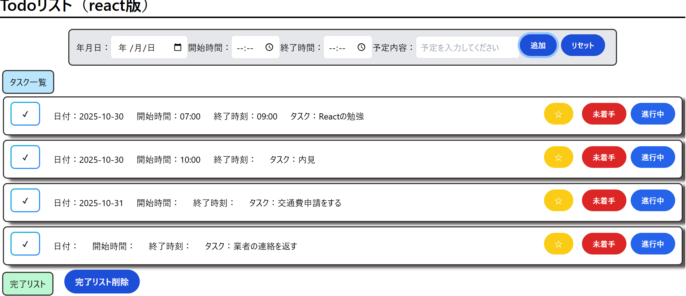
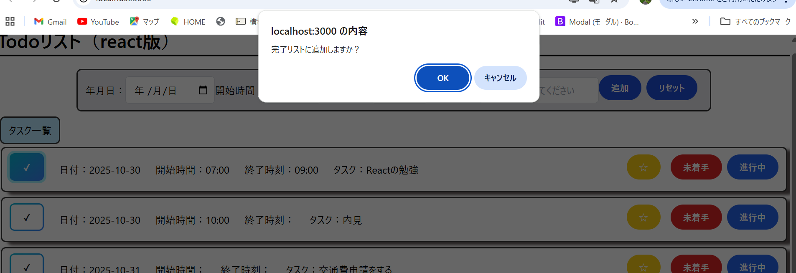
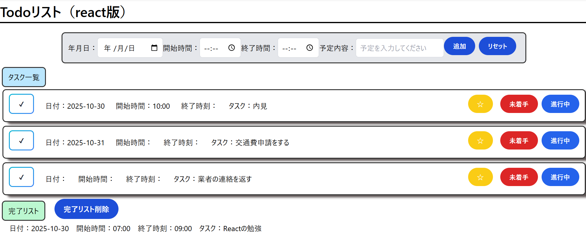
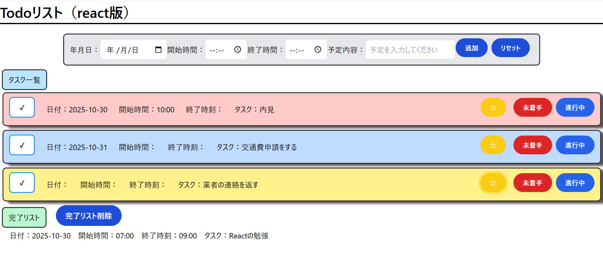

# 📝 Todo List App (react版)

このwebアプリは、Reactを学習後，TodoアプリのJavescript版(https://github.com/wataru-creato/Todo-app)を基に再度作成したものです。
タスクの追加、状態管理（未着手・進行中・完了）、削除などの基本操作を通してREACTの状態管理を学びました。
フレームワークとして新しくTailwindCSSを使用して技術を学ぶことができました。

---

## 使用技術
- JavaScript (ES6)
- React (useState,useEffect)
- CSS / TailwindCSS
- ブラウザの LocalStorage を使用したデータ保存

---

## ✨ 主な機能

- ✅ タスクの追加  
- ❌ タスクの削除  
- ✔️ 完了済みタスクのチェック
- 🔍 ステータス変更（重要☆/未着手/進行中/完了）
- 🌇　完了タスクの表示と完了リストの一括削除
- 💾 localStorage による保存  

---

## 🚀 デモ

公開URL:(https://wataru-creato.github.io/-REACT-Todo-app/)

- 基本的な画面，タスクを追加する，タスクを完了する（✔ボタン），タスクの完了リストをすべて消す，タスクの色を変える，リセットする（すべて消す）ボタンが存在する

- タスクの✔ボタンを押した時にはアラートを表示している

- ✔ボタンが押されたらタスク一覧から完了リストに移動する

- 右の色のついたボタンでそれぞれ状態を変えることができる

# 開発で学んだこと

- Reactの構成理解
親コンポーネントがデータや処理を管理し、子コンポーネントが見た目（UI）を担当するというReactの考え方を理解しました。
処理と見た目を分けて考えることで、コードの整理や保守性が高まることを実感しました。

- useStateを使った状態管理
JavaScriptのように直接中身を変更するのではなく、新しい配列を生成して置き換える必要があるという仕組みを理解しました。
状態を安全に更新するための考え方（イミュータブルな更新）を身につけることができました。

- 状態の種類ごとにuseStateを分ける重要性
form入力用とリスト保存用の状態を別々に管理することで、処理の流れを明確にし、不要な再レンダリングを防げるようになりました。

- filterを使った削除の仕組み
「削除したように見せる」処理として、filterを使って特定のタスクを除外する方法を理解しました。
ただ削除するのではなく、データをどう見せるかという発想が持てるようになりました。

- Tailwind CSSによるUI改善
Bootstrapを使っていた頃よりも柔軟にデザインを調整でき、構造を意識したUI設計ができるようになりました。

- 理解の仕方の変化
最初は「なぜそう書くのか」が曖昧でしたが、わからない箇所で立ち止まり、
「何がわかっていないのか」を言葉にして整理するようにしました。
その結果、Reactがどのように動いているのかを、自分の言葉で説明できるようになりました。
## 今後の課題

- Appコンポーネント内にすべての処理が集中しているため、機能ごとにコンポーネントを分けるとより見通しが良くなる。  
- Tailwind CSSのクラスが多くなっているため、共通部分を整理して読みやすくする。  
- 状態（status / done）の扱いを整理し、今後の拡張に対応しやすい構造にする。  
- 関数やロジックのまとまりを意識して整理し、処理の流れをより明確にする。

## まとめ

 今回のTodoリストを通してReactは書き方ではなく考え方で書くという感覚をつかむことが出来ました。
 わからない部分があったら言語化して、納得するまで言語化することを心掛けて勉強し作成しました。
 今後は外部APIやバックエンドの知識をつけてよりフルスタック寄りのアプリが作れるように学習していきます。